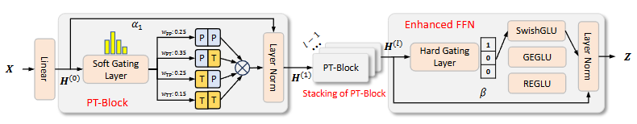
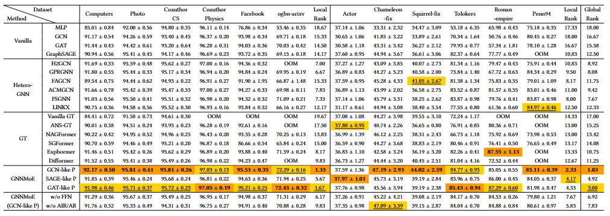

# Mixture of Experts Meets Decoupled Message Passing: Towards General and Adaptive Node Classification
### 1 Overview of Model Architecture and Performance



### 2 Python environment setup with Conda
```bash
  conda env create -f requirement.yaml
```

### 3 Data Preparation
For all datasets, we employ 10 different random seeds to ensure consistent data splits. Each dataset is randomly divided into training, validation, and testing sets with a fixed ratio of 48%, 32%, and 20%, respectively.

### 4 Code Execution
#### 4.1 File Structure
- data -- put data in this dir
- model -- MoE model
- main.py -- run this 
- utils.py -- utils

#### 4.2 Code Execution
```bash
  python main.py -D computers -M MoE
```

#### 4.3 Hyper-parameter Space
- learning rate: [0.005, 0.01, 0.05, 0.1]
- dropout rate: [0.3, 0.5, 0.7, 0.9]
